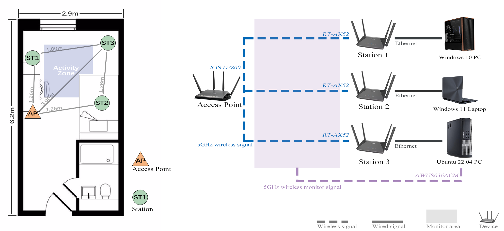
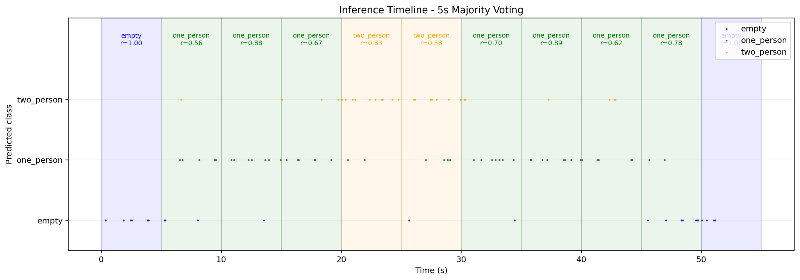

# Minimal BeamSense

```
    __  ____       _                 __   ____                      _____                    
   /  |/  (_)___  (_)___ ___  ____ _/ /  / __ )___  ____ _____ ___ / ___/___  ____  ________ 
  / /|_/ / / __ \/ / __ `__ \/ __ `/ /  / __  / _ \/ __ `/ __ `__ \\__ \/ _ \/ __ \/ ___/ _ \
 / /  / / / / / / / / / / / / /_/ / /  / /_/ /  __/ /_/ / / / / / /__/ /  __/ / / (__  )  __/
/_/  /_/_/_/ /_/_/_/ /_/ /_/\__,_/_/  /_____/\___/\__,_/_/ /_/ /_/____/\___/_/ /_/____/\___/ 
                                                                                             
```

_It's my final year project and have only been tested on my own environment. It's to be expected if you find something not working properly..._


Minimal BeamSense is a lightweight Wi-Fi sensing prototype for coarse indoor state recognition using commodity 802.11ac hardware.  
The project captures compressed beamforming feedback (CBF) / beamforming-feedback-angle-related information from normal AP--STA communication, converts it into fused BFA tensors, and uses a small CNN pipeline to classify simple environmental states.

This repository contains the processing scripts used in the project. It does not include raw packet captures, trained models, private hardware identifiers, or personal experiment data.

## System overview



The hardware setup uses one access point, three RT-AX52 bridge-style stations, and three backend devices. The Ubuntu machine also acts as the sniffer through an external monitor-mode Wi-Fi adapter. The final sensing setup focuses on the dominant B-main link and uses low-density beamforming feedback captured from ordinary communication traffic.

## Example output




project workflow:
1. Start foreground iperf3 traffic between the Windows endpoints and the Ubuntu receiver.
2. Run the Ubuntu capture script to capture CBF-related frames, run QC, export per-peer CSV files, and push the session to Windows.
3. Run the Windows session preparation and MATLAB-based BFA extraction pipeline.
4. Build fused tensors for training or inference.
5. Train/evaluate the Keras CNN model, or run blind inference and plot the prediction timeline.


## replace all placeholders with real values before launching

Before running them, replace every placeholder with your local value:

```text
<PROJECT_ROOT>
<MATLAB_EXE>
<CAPTURE_ROOT>
<WINDOWS_REMOTE_BASE_SUBDIR>
<MONITOR_IFACE>
<AP_BSSID>
<STA_A_MAC>
<STA_B_MAC>
<STA_C_MAC>
<WIN10_IP>
<WIN11_IP>
<UBUNTU_IP>
<SMB_USERNAME>
<SMB_PASSWORD>
<SMB_SHARE_NAME>
...
```


script:

```bash
ubuntu/run_capture_qc_push_2.sh
```

It automates the Ubuntu-side capture workflow:

```text
write manifest -> capture -> QC/export -> refresh manifest -> push to Windows
```

It does **not** start `iperf3` traffic on Win10 or Win11. Those client commands must be started separately before the capture window. A full multi-machine one-click script is not included because the traffic sources are on different machines.

A command template for the full experiment sequence is provided in:

```text
docs/WORKFLOW_TEMPLATE.md
```

structure:

```text
.
├── prepare_session_v2.ps1
├── run_session_pipeline_v2.ps1
├── ubuntu/
│   ├── capture_session.sh
│   ├── run_capture_qc_push_2.sh
│   ├── qc_and_export_session.sh
│   ├── push_session_to_win10.sh
│   ├── write_session_manifest.py
│   └── config/peers.json
├── python/
│   ├── analysis/
│   ├── dataflow/
│   ├── inference/
│   ├── matlab/
│   ├── plot/
│   └── states_e12p_bmain_keras/
├── visualize/
└── docs/
    ├── WORKFLOW_TEMPLATE.md
    └── images/
```

See `docs/WORKFLOW_TEMPLATE.md` for the full template. The core sequence is:

```bash
# Ubuntu: iperf3 servers
iperf3 -s -B <UBUNTU_IP> -p 5201
iperf3 -s -B <UBUNTU_IP> -p 5202
```

```powershell
# Win10 endpoint
iperf3.exe -c <UBUNTU_IP> -B <WIN10_IP> -u -b <RATE_A> -t <DURATION_SEC> -i 1 -p 5201

# Win11 endpoint
iperf3.exe -c <UBUNTU_IP> -B <WIN11_IP> -u -b <RATE_B> -t <DURATION_SEC> -i 1 -p 5202
```

```bash
# Ubuntu capture/QC/push
cd <REPO_ROOT>/ubuntu

./run_capture_qc_push_2.sh \
  <SESSION_NAME> \
  <LAYOUT_NAME> \
  "iperf A=<RATE_A> B=<RATE_B>" \
  "rtax52_a,rtax52_b,rtax52_c" \
  <PREHEAT_SEC> \
  <CAPTURE_SEC> \
  "<ORIENTATION_NOTE>" \
  "<SESSION_NOTES>"
```

